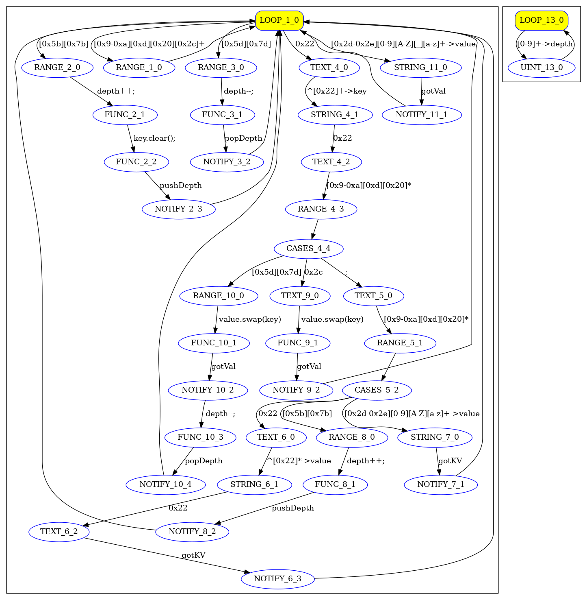

This is a demonstration of using the json-parsing example.
The code (json.h and json.cc) was automatically generated using vProto at https://cgen.dev
The application demonstrates operation in 2 modes: jsonFullFlow or jsonMaxPerf.
testRapidJson - is used as a benchmark for performance comparison.
- ***jsonFullFlow*** streaming processing (any data fragmentation, data can arrive byte by byte, result will be same)
- ***jsonMaxPerf*** lack of fragmentation support (std::string_view) achieving maximum performance in this mode

The application uses input test data from 'input.txt', outputs the result to the file 'output.txt' and report in 'valgrind.txt'.



### cmake Build/Run/Clean:
Go to the jsonFullFlow or jsonMaxPerf directory, then:
```bash
cmake -B build
```
```bash
cd ./build
```
```bash
make
```
```bash
make install
```
```bash
make uninstall
```

### Example of usage
- **Include** "json.h" (#include "json.h")
- **Declare** user functions from "jsonResult" (section "Don't forget to declare" from .h file)
- **Add Linking Library** -ljson (libjson.a)
