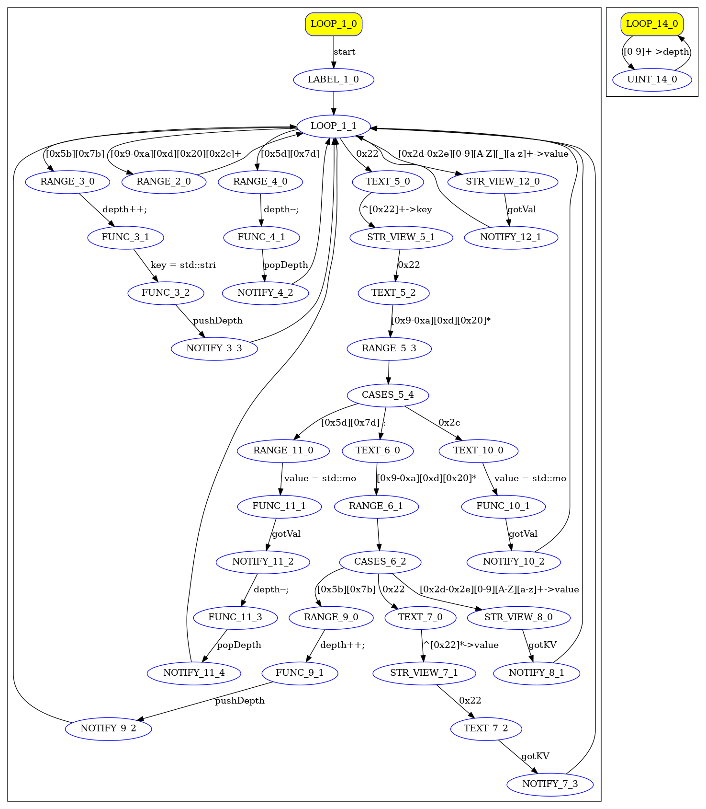

This is a demonstration of using the json-parsing example.
The code (json.h and json.cc) was automatically generated using vProto at https://vsyn.ru
The application demonstrates operation in 3 modes:
jsonFullFlow - streaming processing (any data fragmentation, data can arrive byte by byte)
jsonValueFlow - streaming key processing (values can be fragmented)
jsonFullFlow - lack of fragmentation support (std::string_view) achieving maximum performance in this mode.

testRapidJson - is used as a benchmark for performance comparison.

The application uses input test data from 'input.txt', outputs the result to the file 'output.txt' and report in 'valgrind.txt'.

